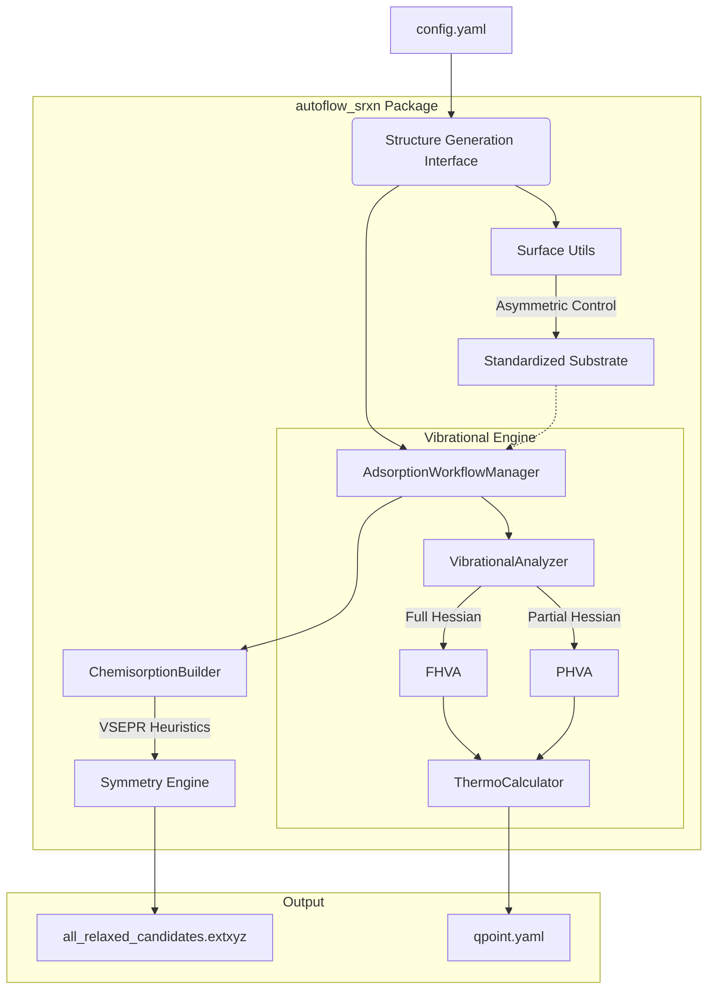

# AutoFlow-SRXN: Automated Surface Reaction Workflow

**AutoFlow-SRXN** is a high-fidelity, fully-automated framework designed for high-throughput exploration and generation of adsorption and reaction structures between arbitrary precursors and substrates. It leverages geometric coordination principles, machine learning interatomic potentials (MLIPs), and statistical mechanics to predict thermodynamic stability and reaction kinetics at material interfaces.

---

## 1. Scientific Domain Expertise

### 1.1 Multi-Vector VSEPR Coordination Engine
The framework utilizes a generalized, valence shell electron pair repulsion (VSEPR) based engine to autonomously detect and passivate undercoordinated surface sites across arbitrary materials.

For a surface atom $i$ with $n$ existing covalent neighbors and a target valence $V_{target}$, the engine identifies $m = V_{target} - n$ dangling bonds. The 3D orientation of these vectors is determined algorithmically:
- **Singular Bonds ($m=1$)**: Points exactly opposite to the normalized sum of existing neighbor vectors.
- **Dual Bonds ($m=2$)**: Optimized for tetrahedral/square-planar environments (e.g., Si(100) dimers), spreading vectors according to $AX_2E_2$ VSEPR geometry.
- **Surface Saturation ($m \ge 3$)**: Distributes vectors in a symmetric conical spread around the primary vacuum-pointing axis.

### 1.2 Asymmetric Substrate Factory
The framework automates the generation of complex surface models with precise termination control.
- **Asymmetric Termination**: Supports separate atomic plane constraints for top and bottom surfaces (e.g., Silanol-terminated top vs. Oxygen-terminated bottom).
- **Side-Specific Passivation**: Enables independent passivation coverage for different sides of the slab, critical for modeling realistic asymmetric experimental conditions.
- **Steric-Constraint Expansion**: Autonomously expands the supercell to satisfy a `target_area` constraint, ensuring periodic boundary stability for large adsorbates like DIPAS.

### 1.3 Partial Hessian Vibrational Analysis (PHVA)
To accelerate thermodynamic calculations and kinetic modeling, the framework implements **Partial Hessian Vibrational Analysis**.
For a system with $N_{total}$ atoms, the full Hessian matrix $H \in \mathbb{R}^{3N \times 3N}$ is approximated by a submatrix $H_{active} \in \mathbb{R}^{3N_{active} \times 3N_{active}}$:
$$ H_{ij} \approx 0 \quad \text{if } i \text{ or } j \notin \text{Active Set} $$
The **Active Set** is dynamically defined as the adsorbate plus all substrate atoms within a user-defined cutoff radius $R_{phva}$ (default 3.5 Å), significantly reducing the number of force calls required for frequency extraction.

### 1.4 Thermodynamics & Gibbs Free Energy
The engine integrates vibrational data to calculate finite-temperature thermodynamic properties using the Harmonic approximation.
- **Vibrational Partition Function**: $Z_{vib} = \prod_i \frac{e^{-\beta \hbar \omega_i / 2}}{1 - e^{-\beta \hbar \omega_i}}$
- **Gibbs Free Energy**: $G(T) = E_{pot} + ZPE + \int C_p dT - TS$

---

## 2. Strategic Objectives
- **High-Throughput Exploration**: Rational search of the potential energy surface (PES) using symmetry-aware site identification.
- **MLIP-Driven Accuracy**: High-fidelity relaxation and frequency calculations using **MACE-MP-0** foundation models.
- **PHVA/FHVA Benchmarking**: Systematic validation of partial Hessian approximations against full Hessian references.
- **Standardized Data Export**: Generation of human-readable `qpoint.yaml` files and `all_relaxed_candidates.extxyz` for visualization.

---

## 3. Architecture Map

### 3.1 Logical Data Flow


### 3.2 Simulation Backend Design

All relaxation and force calculations are routed through `SimulationEngine` (`src/potentials.py`), which selects a backend based on `model_type` in `config.yaml`.

| Backend | Model | Runtime | Interface |
| :--- | :--- | :--- | :--- |
| **ASE** | MACE-MP-0 | In-process Python | `mace.calculators.mace_mp` |
| **LAMMPS** | SevenNet (7net) | External binary | `pair_style e3gnn[/parallel]` |

**MACE** is loaded as an ASE calculator and runs entirely within the Python process. ASE constraints (e.g. `FixAtoms`) are handled natively.

**SevenNet** is driven through an external LAMMPS binary via `LammpsMLIAPEngine`. The engine automatically generates LAMMPS input scripts at runtime, including:
- `pair_style e3gnn` (serial) or `e3gnn/parallel` (MPI) for the base potential.
- `hybrid/overlay e3gnn[/parallel] zbl/pair` when ZBL is enabled (`use_zbl: true`), with per-pair cutoffs derived from reference POSCAR dimers in `zbl_db_path` or ASE covalent radii as fallback.
- `region rFIX block ... / fix setforce 0 0 0` when ASE `FixAtoms` constraints are present on the atoms object, mirroring the `ex/fixed_z_ex_script.txt` pattern.

**Configuration:**
```yaml
potentials:
  model_type: "mace"       # ASE path — uses MACE-MP-0 in-process
  # model_type: "sevennet" # LAMMPS path — requires lammps binary + 7net model

lammps:                    # Only used when model_type: "sevennet"
  binary_path: /usr/bin/lammps
  model_path:  /models/7net.pt
  parallel:    false
  use_zbl:     false
  zbl_db_path: null        # Path to {elem1}-{elem2}/POSCAR reference dimers
```

### 3.3 Directory Structure
- `src/`: Core package logic (surface utils, adsorption managers, vibration analysis).
- `examples/`:
    - `benchmark_phva_sio2/`: Standardization and validation of PHVA on SiO2(001).
    - `example_dipas/`: Si(100) surface reaction stage-wise discovery.
- `structures/`: Base crystal and precursor configurations.

---

## 4. Operational Harness

### 4.1 Installation
```bash
pip install -e .
pip install ".[mace]" # For MLIP support
```

### 4.2 Running PHVA Benchmark
To run the standardized PHVA vs FHVA benchmark on a silanol-terminated SiO2 surface:
```bash
cd examples/benchmark_phva_sio2
python run_autoflow_benchmark.py
```
This script will:
1. Generate an asymmetric SiO2 slab.
2. Perform MD equilibration at 500K.
3. Automatically search for DIPAS adsorption sites.
4. Execute both FHVA and PHVA and generate a comparative `qpoint.yaml`.

---

## 5. Physical Standards

| Property | Standard Unit | Reference |
| :--- | :--- | :--- |
| **Energy** | Electronvolt (eV) | - |
| **Frequency** | Wavenumber (cm⁻¹) | 1 THz $\approx$ 33.356 cm⁻¹ |
| **Distance** | Angstrom (Å) | - |
| **Temperature**| Kelvin (K) | Default: 298.15 K |

**DOIs & References:**
- MACE Potential: [10.48550/arXiv.2206.07697]
- ASE Framework: [10.1088/1361-648X/aa680e]
