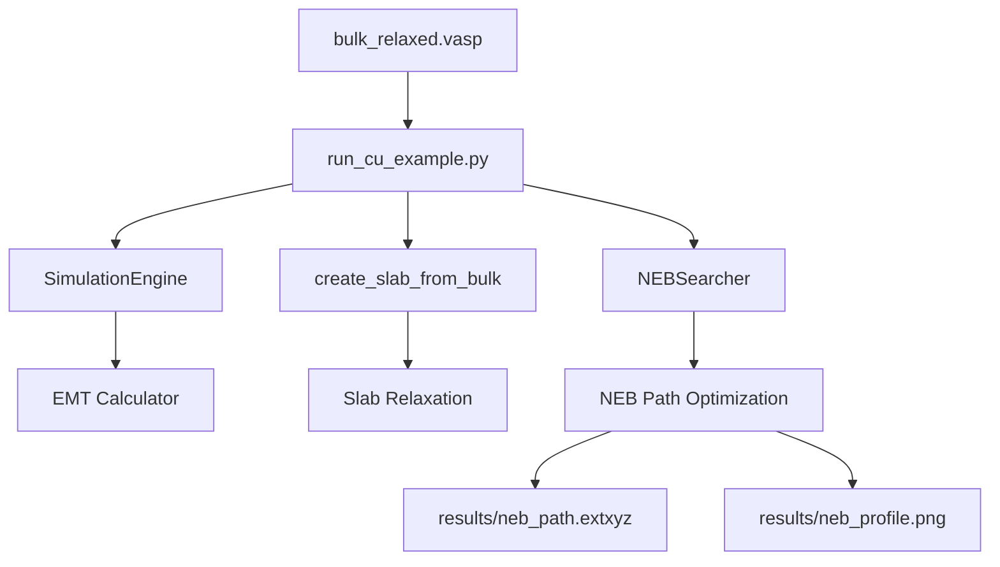

# Cu Surface Diffusion Validation (EMT)

This example validates the Transition State (TS) search engine using a classic benchmark: the hopping diffusion of a Copper (Cu) adatom on a Cu(111) surface. It follows the core `autoflow_srxn` logic by performing bulk relaxation, automated slab generation, and NEB path optimization.

## 1. Scientific Domain Expertise

### Physical Model
Surface diffusion is a fundamental process in crystal growth and catalysis. On an FCC(111) surface, there are two types of hollow sites: **FCC** (no atom in the second layer) and **HCP** (atom in the second layer). The diffusion occurs via a hopping mechanism between these sites.

### Governing Equations
The diffusion rate $D$ is governed by the Arrhenius equation:
$$D = D_0 \exp\left(-\frac{E_a}{k_B T}\right)$$
where $E_a$ is the activation energy (barrier), defined as:
$$E_a = E_{TS} - E_{initial}$$
$E_{initial}$ is the energy of the adatom at the stable hollow site, and $E_{TS}$ is the energy at the transition state (bridge site).

### Potential: Effective Medium Theory (EMT)
For this validation, we use the **Effective Medium Theory (EMT)** potential. It is a computationally efficient semi-empirical method for metallic systems, capturing multi-body effects via the electron density of the surrounding medium.

## 2. Strategic Objectives
- Validate the **Nudged Elastic Band (NEB)** implementation in `autoflow_srxn`.
- Demonstrate the automated **Bulk-to-Slab** workflow using `create_slab_from_bulk`.
- Provide a robust smoke-test for the transition state pipeline.

## 3. Operational Harness

### Prerequisites
- Python environment with `ase`, `numpy`, and `yaml`.
- `autoflow_srxn` package installed or in the PYTHONPATH.

### Running the Validation
Execute the following command from the project root:
```bash
python autoflow_SRXN/examples/TS/Cu_diffusion_EMT/run_cu_example.py
```

### Configuration
The simulation parameters are defined in `config.yaml`, which follows the standard `config_full.yaml` schema:
- **Backend**: `emt`
- **Surface**: Cu(111) generated from relaxed bulk.
- **NEB**: 5 intermediate images, IDPP interpolation, FIRE optimizer.

## 4. Results & Analysis

### Workflow Stages
1. **Bulk Optimization**: Finds the equilibrium lattice constant for EMT Cu (~3.60 Å).
2. **Slab Preparation**: Cuts a (111) slab and relaxes the surface layers.
3. **State Preparation**: Places adatoms at FCC and HCP sites and relaxes them.
4. **NEB Search**: Finds the minimum energy path (MEP) and the transition state.

## 5. Architecture Map



## 6. Physical Standards

| Property | Value / Unit |
| :--- | :--- |
| Energy Unit | eV |
| Force Unit | eV/Å |
| Lattice Constant (Cu) | ~3.6 Å (EMT) |
| Convergence (fmax) | 0.05 eV/Å |

## 7. References
- [1] Jacobsen, K. W., Nørskov, J. K., & Puska, M. J. (1987). "Interatomic interactions in the effective-medium theory." *Physical Review B*, 35(14), 7423. DOI: [10.1103/PhysRevB.35.7423](https://doi.org/10.1103/PhysRevB.35.7423)
