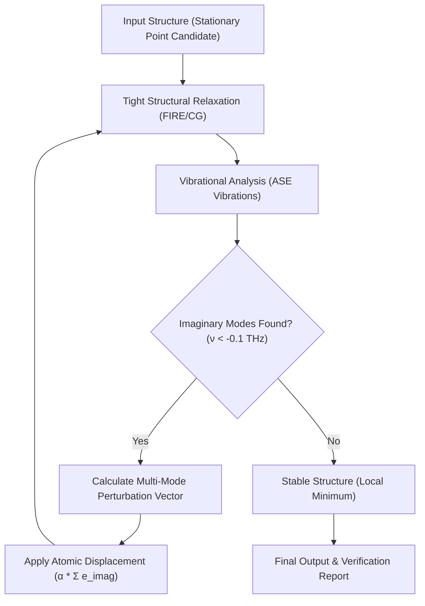

# Mode-Following Structural Relaxation: Stability Refinement

This directory contains examples of automated structural refinement through iterative mode-following. The objective is to navigate the Potential Energy Surface (PES) by identifying and eliminating imaginary vibrational modes to reach a true local minimum, ensuring thermodynamic stability for precursors and surface models.

## 1. Scientific Domain Expertise: Theoretical Background

### A. Stationary Points on the Potential Energy Surface (PES)
In computational chemistry, the equilibrium geometry of a system is a stationary point on the PES where the gradient of the potential $V$ with respect to atomic coordinates $\mathbf{R}$ vanishes:
$$\nabla_{\mathbf{R}} V(\mathbf{R}) = 0$$

To categorize a stationary point, we analyze the **Hessian matrix** $\mathbf{H}$, defined by the second derivatives of the energy:
$$H_{ij} = \frac{\partial^2 V}{\partial R_i \partial R_j}$$

### B. Vibrational Frequencies and Stability
The eigenvalues $\lambda$ of the mass-weighted Hessian ($\mathbf{H}_m$) correspond to the square of the vibrational frequencies $\omega$:
$$\mathbf{H}_m \mathbf{q} = \omega^2 \mathbf{q}$$

- **Local Minimum**: All eigenvalues are positive ($\omega^2 > 0$).
- **Unstable State**: One or more eigenvalues are negative ($\omega^2 < 0$), resulting in **imaginary frequencies** ($i\omega$). This indicates that the structure is at a maximum along those specific normal mode coordinates (e.g., a saddle point).

### C. Mode-Following Perturbation Logic
To eliminate imaginary vibrational modes and descend toward a stable local minimum, the system must be perturbed along the eigenvector $\mathbf{e}_{\text{imag}}$ corresponding to the unstable mode. The updated coordinates $\mathbf{R}_{\text{new}}$ are calculated as:
$$\mathbf{R}_{\text{new}} = \mathbf{R}_{\text{old}} + \sum_{k \in \text{imag}} \alpha_k \cdot \mathbf{e}_k$$
where $\alpha_k$ is the perturbation scale factor. This coordinated displacement moves the system away from the unstable region of the PES, allowing the subsequent relaxation to find a lower-energy minimum.

---

## 2. Strategic Objectives & Workflow

The workflow implements a "Perturb-Analyze-Relax" cycle to systematically eliminate imaginary modes.

### Architecture Map


---

## 3. Example Descriptions

This repository provides two distinct use cases for mode-following:

### A. Precursor Stability (`/precursor`)
- **System**: Isolated DIPAS (Diisopropylaminosilane) molecule.
- **Physical Constraint**: Isolated boundary conditions (`center_in_vacuum: true`).
- **Objective**: Identify internal rotation or inversion modes that lead to structural instability.

### B. Surface/Slab Relaxation (`/slab`)
- **System**: Adsorbate on a periodic Si(110) surface.
- **Physical Constraint**: Partial Hessian Vibrational Analysis (PHVA) with a frozen substrate zone (`phva.enabled: true`).
- **Objective**: Eliminate "ghost" imaginary modes often caused by insufficient surface relaxation or high-symmetry adsorption sites.

---

## 4. Result Interpretation & Analysis

### A. Convergence Behavior
A successful refinement is marked by a drop in potential energy and an increase in the minimum frequency ($ \nu_{min} $).

| Cycle | Energy (eV) | Min Freq (THz) | Interpretation |
| :--- | :--- | :--- | :--- |
| 0 | $E_0$ | $-1.00$ | Significant instability |
| 1 | $E_1 < E_0$ | $-0.15$ | Symmetry broken; approaching minimum |
| Final | $E_f < E_1$ | $+0.02$ | **Stable (Local Minimum)** |

### B. Physical Interpretation of Zero Modes
Zero modes ($\omega \approx 0$) correspond to infinitesimal symmetry operations of the system. In computational results, numerical noise usually results in values within $\pm 0.05$ THz.

1.  **Isolated Molecules**:
    - **Non-linear Molecule**: $3N$ total modes consist of **6 zero modes** (3 translations + 3 rotations) and $3N-6$ vibrations.
    - **Linear Molecule**: **5 zero modes** (3 translations + 2 rotations, as rotation along the molecular axis has no moment of inertia) and $3N-5$ vibrations.
2.  **Solid State (Bulk)**:
    - Rotational symmetry is broken by the lattice. Only **3 translational (acoustic) modes** exist at the $\Gamma$-point.
3.  **Slab Structures**:
    - Similar to bulk, slabs typically exhibit **3 translational (acoustic) modes**. 
    - However, in a **Fixed-Bottom Slab** (common in surface science), all translational modes may shift to non-zero values because the center-of-mass motion is constrained by the frozen atoms. In a fully relaxed slab, the Z-translation (perpendicular to surface) and XY-translations remain as acoustic modes at $\Gamma$.

**Note**: These zero modes should not be followed for structural refinement, as they represent global movement rather than internal structural instability.

---

## 5. Usage

To execute the examples, navigate to the directory and run the local wrapper:

```powershell
# Example: Precursor refinement
cd precursor
python run_mode_following.py
```

### Physical Standards & Units
| Property | Unit | Standard/Threshold |
| :--- | :--- | :--- |
| Energy | eV | - |
| Frequency | THz | Stability > -0.1 THz |
| Displacement ($u$) | Å | 0.005 - 0.01 Å |
| Perturbation ($\alpha$) | Å | 0.1 - 0.5 Å |
| Force ($f_{max}$) | eV/Å | < 0.001 eV/Å |

---

## 6. Implementation Credits
- **Potential Model**: MACE-MP-0 (ML-IAP).
- **Phonon Engine**: **ASE Vibrations Module** (Finite displacement method).
- **Interoperability**: Phonopy-compatible `qpoints.yaml` output for post-processing and validation.
- **Logic**: `autoflow_srxn.vibrational.mode_following`.
